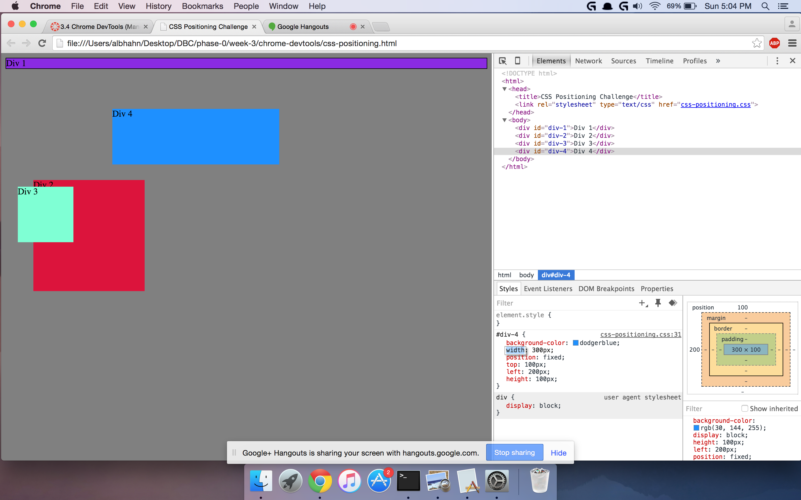
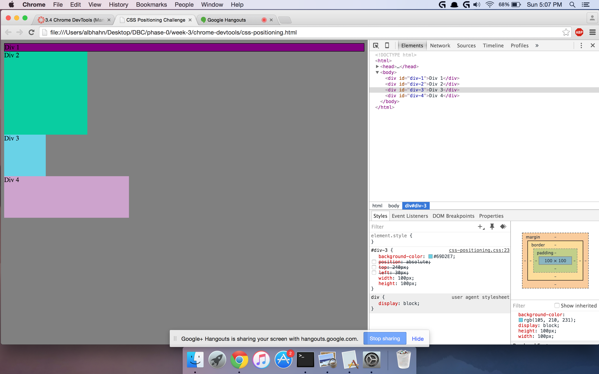
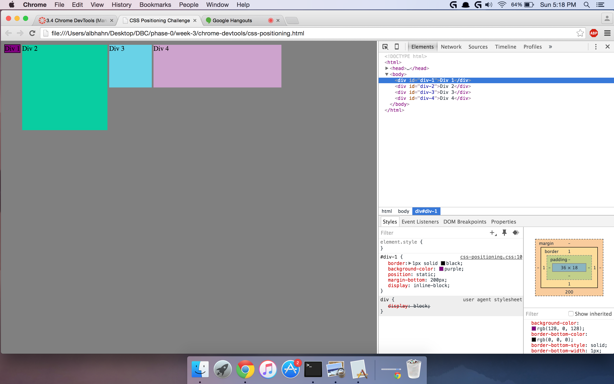
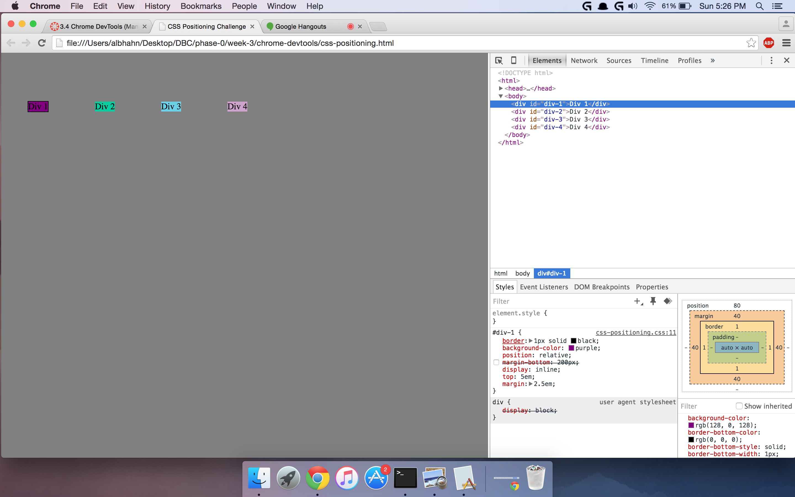
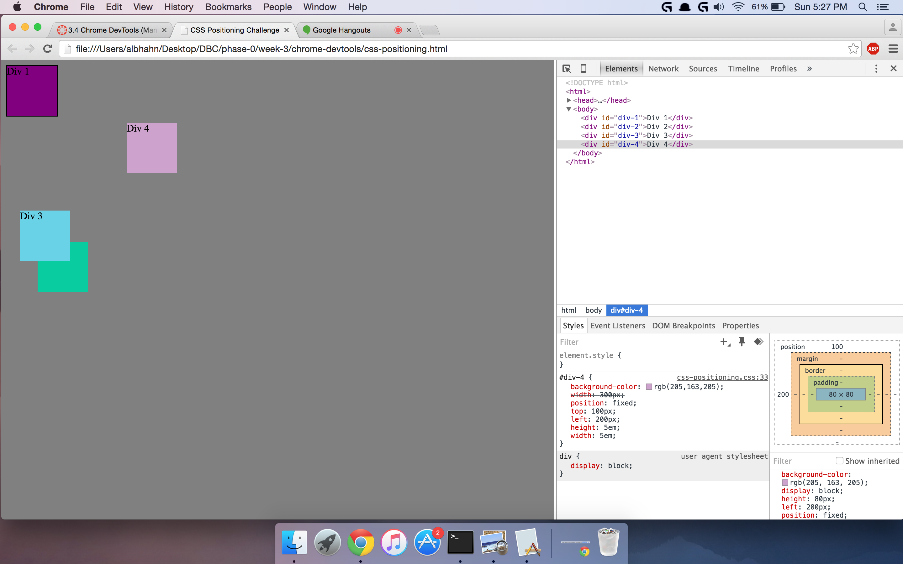
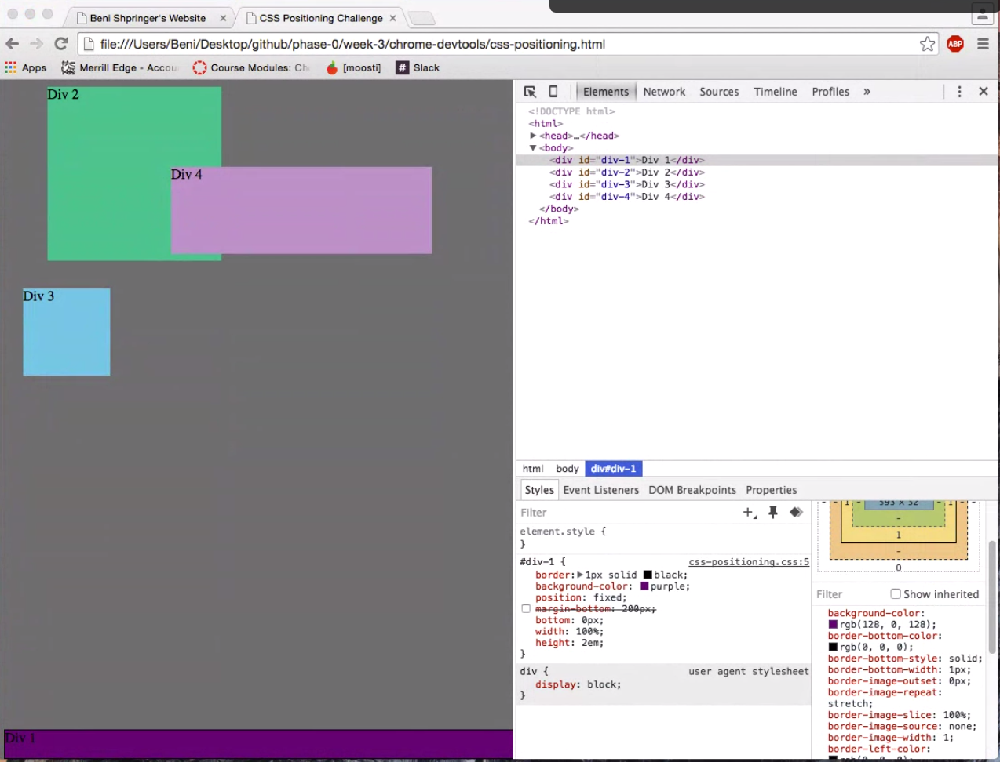
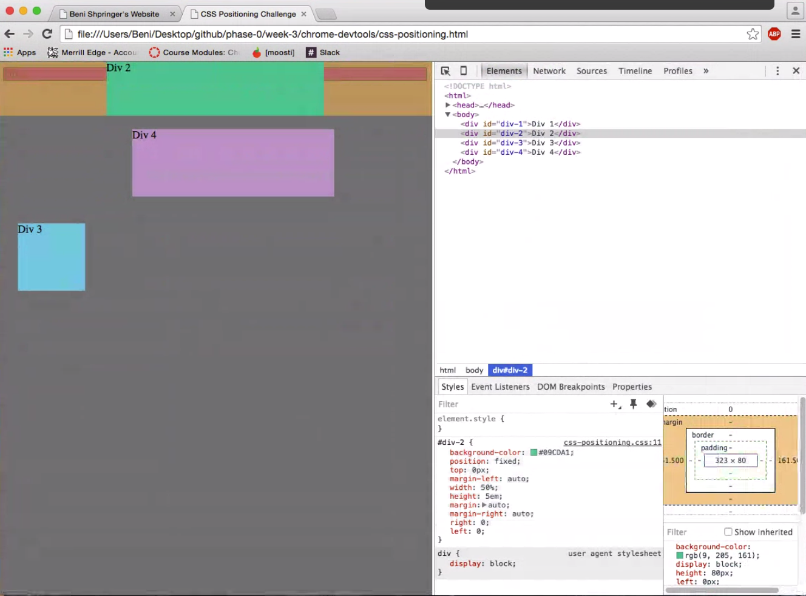
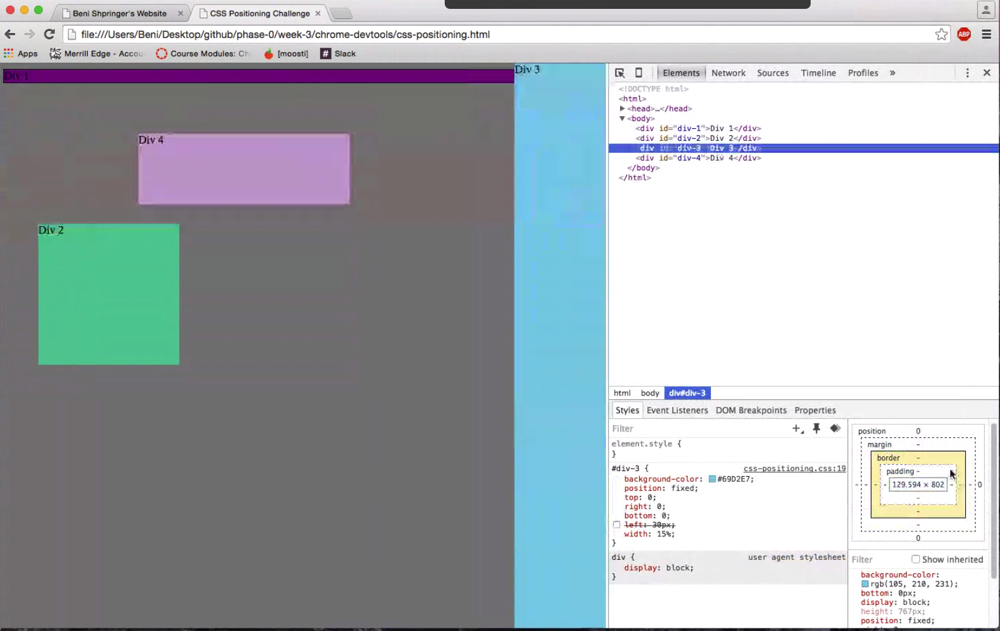
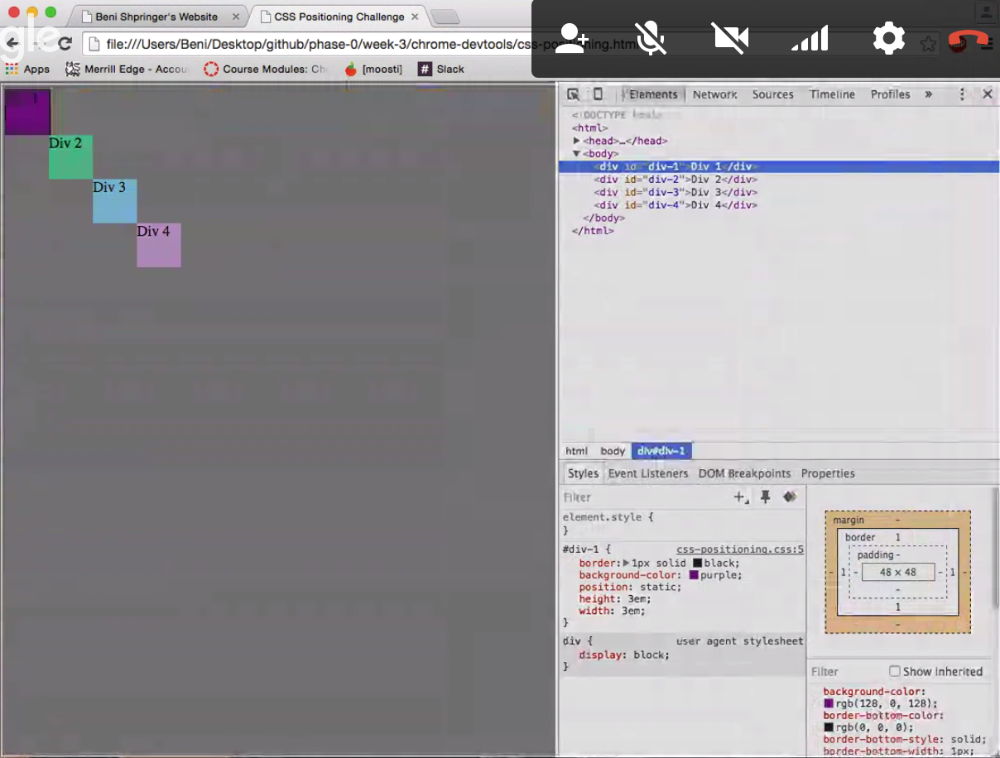

##How can you use Chrome's DevTools inspector to help you format or position elements?##
It's very helpful, as it allows you to actually see your code live, and shows what each change/update does.

##How can you resize elements on the DOM using CSS?##
By changing the selected elements' height or widths px, em, or percentage number.

##What are the differences between absolute, fixed, static, and relative positioning? Which did you find easiest to use? Which was most difficult?##
Absolute position is determined by its parent element's position. Fixed position is almost the opposite, where its completely independent of everything else on the webpage and will always be visible, regardless of the page being scrolled. Static is the default position for every single element. Relative will position an element in relation to its normal position without effecting any other static elements around. I'd say fixed was easiest to use and relative was the hardest.

##What are the differences between margin, border, and padding?##
Margin is the area around the entire element and can clear areas around the border. Borders are outside of the content and defines the edge of an element. Padding is whats right around the main content and will also effect the area inside the content.

##What was your impression of this challenge overall? (love, hate, and why?)##
Both. I loved seeing how DevTools works and how much easier it allows you to mess around and see the changes that you apply. I hated the frustration I went through to position things the way I wanted them to and it being much more difficult than I imagined.