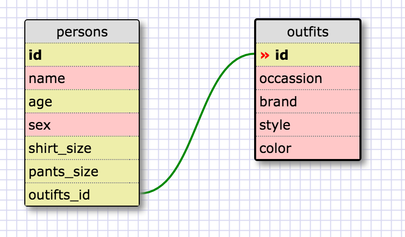

##Release 5: SELECTing data from a database##
1. SELECT * FROM states;

2. SELECT * FROM regions;

3. SELECT state_name, population FROM states;

4. SELECT state_name, population FROM states ORDER BY population DESC;

5. SELECT state_name FROM states WHERE region_id=7;

6. SELECT state_name, population_density FROM states WHERE population_density>50 ORDER BY population_density ASC;

7. SELECT state_name FROM states WHERE population BETWEEN 1000000 AND 1500000;

8. SELECT state_name, region_id FROM states ORDER BY region_id;

9. SELECT region_name FROM regions WHERE region_name LIKE '%Central%';

10. SELECT regions.region_name, states.state_name FROM states INNER JOIN regions ON states.region_id=regions.id ORDER BY region_id;

##Release 6: Your own schema##

##Release 7: Reflection##
**What are databases for?**
They are used to store large amounts of data/information. They can be very complex based on data you want to collect and use with its relationship to one another.

**What is a one-to-many relationship?**
When one value has many other values that directly relate to each other. Which makes more sense to separate them into their own tables.

**What is a primary key? What is a foreign key? How can you determine which is which?**
Primary keys are unique values used to identify each record in a database table. A foreign key points to a primary key in another table and is used to link both tables together.

**How can you select information out of a SQL database? What are some general guidelines for that?**
You can do so by using specific keywords as commands in a statement such as "SELECT" to pick which columns we want information from, and "FROM" to pick which table the information lies in. Some general guidelines when using such keywords/commands are writing them in upper-case, which can help differentiate what's a keyword and what's a column/table value. Semicolon's are also used to separate SQL statements.