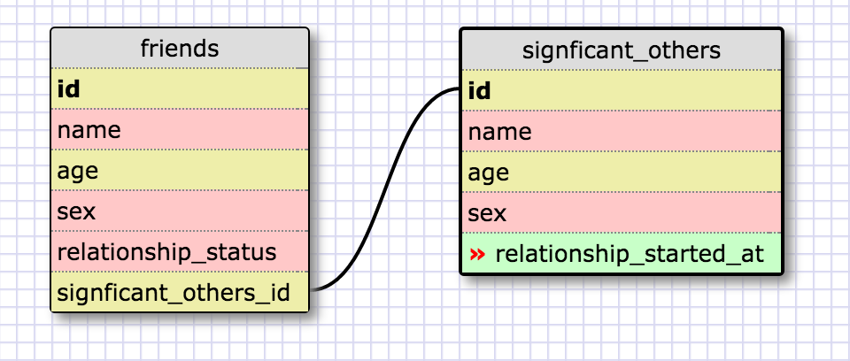

##Release 2: Create a One-to-one Schema##

I would assume this to be a one-to-one relationship because most people should only have one significant other at a given time.

##Release 4: Refactor##

##Release 6: Reflection##
**What is a one-to-one database?**
It's a database used for when two subjects have one connecting relationship between each other.

When would you use a one-to-one database? (Think generally, not in terms of the example you created).
When two subjects contain a connecting relationship of information but one of them can have fields to be left empty/NULL.

What is a many-to-many database?
It's a database that typically has three tables, two of which are particular subjects and one table that is used to represent their relationship and join them.

When would you use a many-to-many database? (Think generally, not in terms of the example you created).
when one or more rows from one table are associated/connected with one or more rows from another table.

What is confusing about database schemas? What makes sense?
I think one-to-one and one-to-many databases make more sense and many-to-many databases can be a bit more confusing. Looking at Release 5's complex database example of artists/artwork also shows a situation where databases can get confusing.